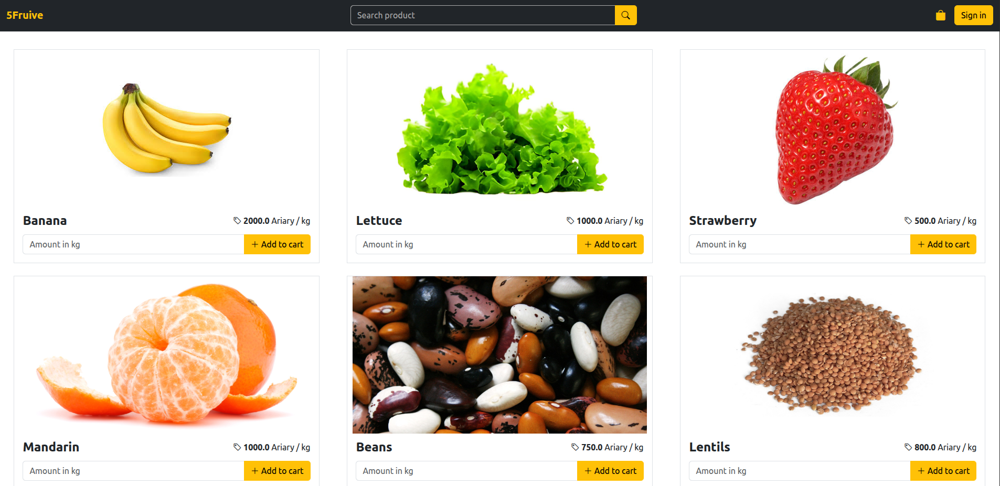

# 5Fruive

[](https://github.com/GimmyR/5fruive/actions/workflows/ci.yaml)

**Live demo:** https://fruive-kl21m.eu-east-1.migetapp.com/

**5Fruive** is an e-commerce application made with **Spring Boot** and **PostgreSQL**.



## Prerequisites

Before building or running the application, make sure you have the following installed :

* **Docker** 29.0.2 (build `8108357`)
* **Docker Compose** 2.40.3

You can do that by installing [Docker Desktop](https://www.docker.com/products/docker-desktop/).

## Build and launch the application

Open a terminal in the project's root directory and run the following command :

```bash
docker compose up --build
```

You can access the application in your browser at http://localhost:8080.

## Login in the application

If you want to sign in as a client or an administrator, you can find user informations in *src/main/resources/data.sql*.

## License

This project is licensed under the MIT License - see the [LICENSE](./LICENSE) file for details.